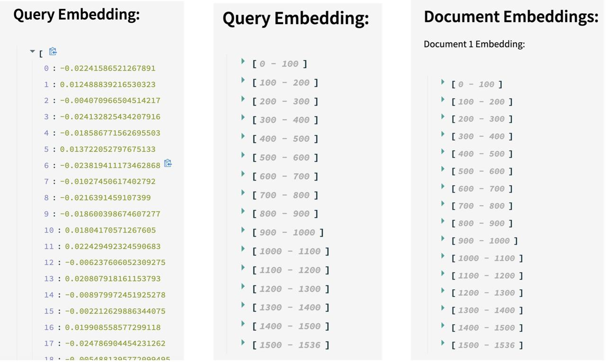

# All In One Chat Bot Using Large Language Model 

# About 

This project explores the development of an innovative ALL-IN-ON CHATBOT powered by the advanced GPT-3.5 Turbo Large Language Model addressing the critical need for efficient data analysis and insights in various industries. The chatbot enables users to seamlessly upload and analyze data in diverse formats, such as CSV, PDF,and DOCX,facilitating streamlined data-driven decision-making for professionals and researchers.

Acknowledging the limitations of existing large language model applications like ChatGPT and Google Bard, this research presents a solution-oriented approach. While ChatGPT’s knowledge retention limitation hinders real-time information retrieval, ChatGPT 3.5 lacks data manipulation capabilities. The introduction of data upload features in ChatGPT 4.0 is commendable but raises privacy concerns Google Bard’s IP tracking adds an additional layer of privacy apprehensions. 

In response, this project proposes solutions to these issues, aiming to create a more comprehensive, secure, and privacy-conscious approach to data utilization and real-time insights. By addressing the limitations and enhancing the practical utility of large language models, the research contributes to the advancement of AI applications.The ALL-IN-ONE CHATBOT exemplifies the possibilities of seamlessly integrating conversational AI and data analysis, improving trustworthiness and versatility in real world scenarios. This work signifies a significant step towards a future where AI-driven tools empower users across diverse domains by bridging the gap between natural language understanding and data analysis

# CSV File Architechture: 

- **File Uploading & Data Processing:** 
Upon accessing the application, users can upload a CSV file, which is temporarily stored in Streamlit memory. The Pandas library is used to parse the CSV file into a DataFrame. Then, the "SmartDataframe" library is invoked, enhancing the DataFrame with conversational features while retaining all its conventional attributes and functions.

- **User Interaction:**  Users are given the privilege to input queries into a text field. The application offers a "Generate" button to initiate the interaction.

- **Natural Language Interaction:** The application primarily relies on OpenAI's GPT-3.5 language model for its functionality. When a user initiates a chat session by clicking the "Generate" button, it triggers the "chat_with_csv" function, which processes the DataFrame and the user's query. Using the GPT-3.5 model, it generates a textual or visual response, which is then displayed to the user via the "st.success" component.

Csv file is uploaded. 

Chat bot processes user query. 

The chat bot also visualises the data. 

# PDF / DOCX File Architechture: 

- **Upload a Pdf/Docx file:** The initial step requires the user to upload a PDF file, enabling them to perform various tasks and operations on the document.

- **Text Extraction:** After the user uploads a PDF file, the text is immediately extracted using the PyPDF2 library. This step ensures the content is accessible and ready for further operations, marking the initial phase of processing the document.

- **Text Splitting:** To manage token limits and improve comprehension, the extracted text is divided into smaller chunks using the CharacterTextSplitter from the Langchain library. The text is split into segments of 1000 characters each, with an overlap of 200 characters between chunks. This segmentation facilitates more effective and granular processing, enabling better analysis and interpretation of large volumes of text.

- **Embedding Creation:** After segmenting the text, the OpenAIEmbeddings library converts these segments into text embeddings, which are numerical vectors representing the semantic meanings of the words. These embeddings capture diverse semantic relationships, enabling efficient processing by the neural network and helping the model understand and represent relationships, including synonyms and analogies.

- **Document search Creation:** After converting the PDF text into embeddings, these embeddings are used to create a document search system with the FAISS vector store. FAISS (Facebook AI Similarity Search) allows efficient similarity searches in large multimedia document datasets, surpassing traditional hash-based search engines.

- **Conversation Chain Creation:** By utilizing the ConversationalRetrievalChain library from Langchain, a chain is created that integrates the OpenAI model and Document Retriever. A LangChain Conversational RetrievalChain is a specialized sequence of processes tailored for conversational retrieval tasks, aimed at answering questions or providing information within a conversational framework.

- **User Query:** The process begins when a user submits a conversational query. The document retriever scans the embeddings of the uploaded file to find the most relevant documents. These documents are then sent to the OpenAI model, which comprehends the context, summarizes information, and generates responses. The model processes the information to provide contextually relevant answers, explanations, or details in response to the user's query. The generated response is then delivered to the user, completing the conversational interaction.

The chat bot summarises the pdf document.

It shows the embedding created. 

The chat bot also shows the similarity search with k=4.

